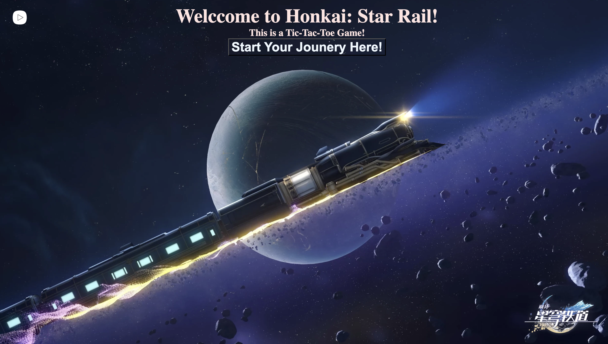

# About
This is a "Honkai: Star Rail" version of tic-tac-toe, featuring first three maps in the "Star Rail" game and beautiful music along with them. One play would play trailblazer(male), the main character in the "Star Rail" game and the other player would paly the role of kafka, who is a member of Stellaron Hunters as one of major dark forces.

# Click and Play
[https://lipusure.github.io/TicTakToe/](#) to see my live project!

## Screenshots

# Offical Game Web Of Honkai: Star Rail
https://hsr.hoyoverse.com/en-us/
All the images and audio are sourced from offcial game.

## Planning & Problem Solving

- Basic frame

## Programming languages
- Programming languages: HTML, CSS, JavaScript

## Bugs to fix 
- Need to add support for mobile screens(or small screens)
- New destination button would accept "click" on the right.

## Lessons learnt
- More detailed and precise planning needed

## More features ahead
- With change of the map, the characters on the left and right would change accordingly, along with the winning image.
- Add an arrow above the two charcters to indicate the current player's turn.
- Substitute the first login page to be an animation in which the stars move.
- Add bot players
